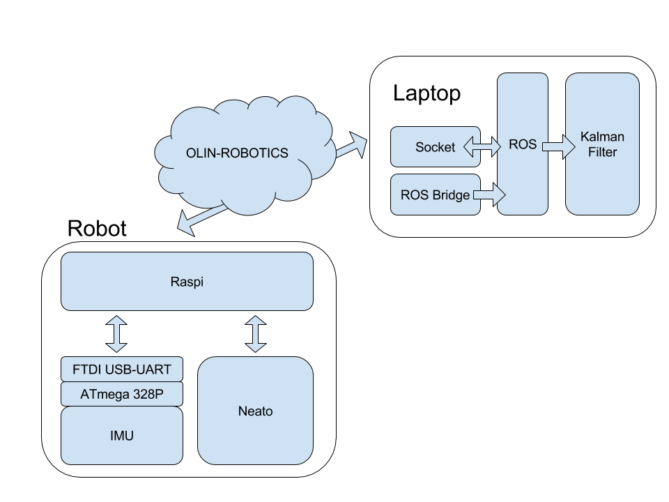
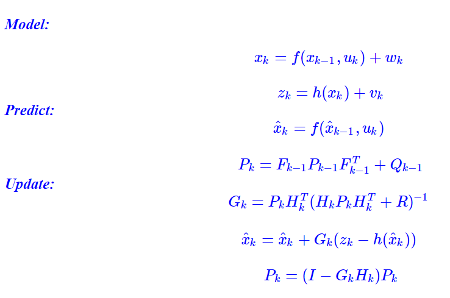
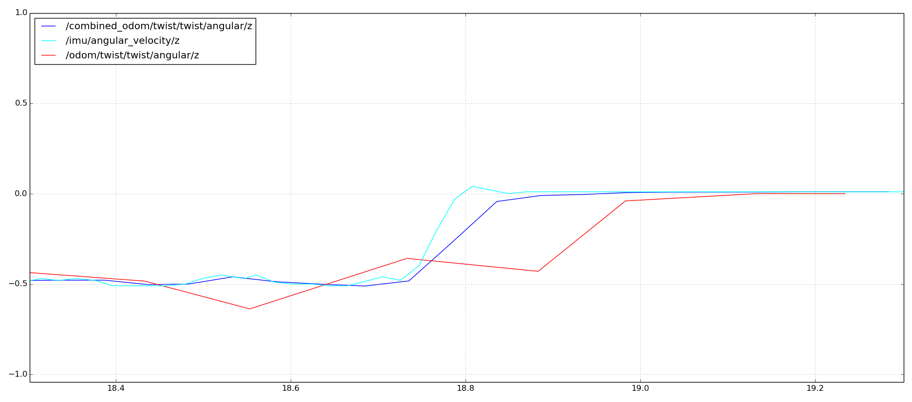

# IMU Sensor Fusion
This is our final project for Computational Robotics class to incorporate a razor IMU sensor to improve the neato's wheel odometry. 

Link to website:
https://xiaozhengxu.github.io/CompRobo_IMU_Sensor_fusion/

# Phase 1

This week our goal was to read IMU data from the arduino, pass it through the pi and publish the data as an IMU message on ROS. 

First, we learned about the neato’s software structure, as shown in the diagram below.

The IMU has an ATmega 328P microcontroller, which is flashed with the Arduino bootloader. This communicates with the raspi through an FTDI USB-UART converter. On the raspi there is code to read from the arduino through serial and send the data through a web socket to the laptop. 

We were in charge of writing the bridge that takes the data sent from the raspi and publishes it to ROS. To do that, we referenced and used the code on https://github.com/KristofRobot/razor_imu_9dof as a starting point. The imu_node.py in this repo read the imu data directly from serial and published it to ROS. What we had to change was to read from a web socket instead. 

In that process, first we learned about UDP and TCP communication protocols. We decided to establish a connection between the raspi and laptop with TCP and then use the IP of the laptop address to send the data packets in UDP. The advantage of UDP should have been that it sends the entire data in one pack, but that wasn’t the case for us, so we had to write our own receive all function. 
After some more editing the code we were able to publish the IMU data to ROS! 

We also changed imu_node.py to follow an object oriented code architecture. 

In order to get odometry and IMU data at the same time, we are required to run a bunch of ROS nodes all at the same time, a perfect use case for launch files! Our launch file takes a `host` argument which we pass to the launch structure from the neato node to establish the standard connection to the robot. We also start up our IMU node, which established the connection between the raspi and IMU, then begins publishing data. We briefly experimented with also starting a Robot Pose EKF node, but decided that the point of this project is to learn about Kalman filters, not just use one that is already built. 

We had some issues running both the neato node and IMU node at the same time, which resulted in the serial communication to both the neato and IMU failing. We’re currently resolving this by plugging in the IMU after we have started up the neato. 

Now that we can access both Odometry data from the neato’s wheels and imu data, we are ready to start implementing an extended Kalman filter! 

April 14th, 2017

# Phase 2
This week we read through a useful, easy to read tutorial explaining the extended kalman filter. https://home.wlu.edu/~levys/kalman_tutorial/
Then we implemented an extended kalman filter based on a simple model, using the standard extended kalman filter formua:

The model is based on the state variables x_k = [x,y,theta, v, w], and 
z_k = [v_odom, w_odom, w_imu]. 

x, y, and theta position and orientation of the robot in the odom frame. v is its forward velocity, and w is its angular velocity (theta_dot). Motor commands were not included in the model. 
This simple model only uses one angular rate measurement from the gyro in the imu (w_imu), and does not include the acceleration measurements from the accelerometer, nor the orientation measurements from the magnotometer. 

Note that the function f(x_k) is non-linear because a change in x, y involves cos(theta)*v*dt and sin(theta)*v*dt, but the sensor function h(z_k) is linear and so can be represented as a constant matrix H_k. 

Our filter has inputs from odometry based on wheel encoders, which is very noisy when the robot turns on carpet. Thus, for the noise estimate values we gave it a high covariance for w_odom. The imu measurement of angular velocity is much less noisy, varying only by 0.02. 

We tried running our filter using these estimates and turning the robot in place (as in the bag files under bags/turning_180_deg) 

The image shows the angular turning rate from odom measurement, imu measurement and our filter output measurement in combined_odom.
The combined odom favored the imu measurement because of the low noise we set. If we reversed the noise amplitude for the two sensors, the combined odom would favor the odom measurement instead. 

We then collected some more bag files including april tag pose estimates to validate our orientation estimate. 

On the testing side we plan to re-run behaviors from the warmup project like drive square to see how accurate the combined_odom is.

insert_pic_here of april tag validation 

Our next steps are incorporating acceleration measurements from the imu into the kalman filter we have.

April 28th, 2017
